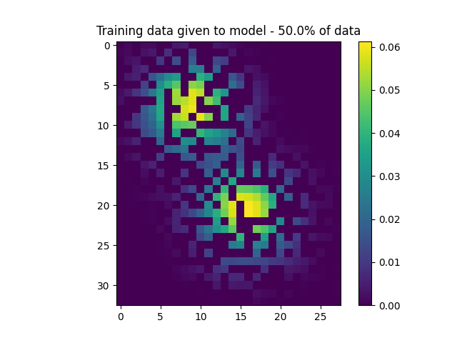
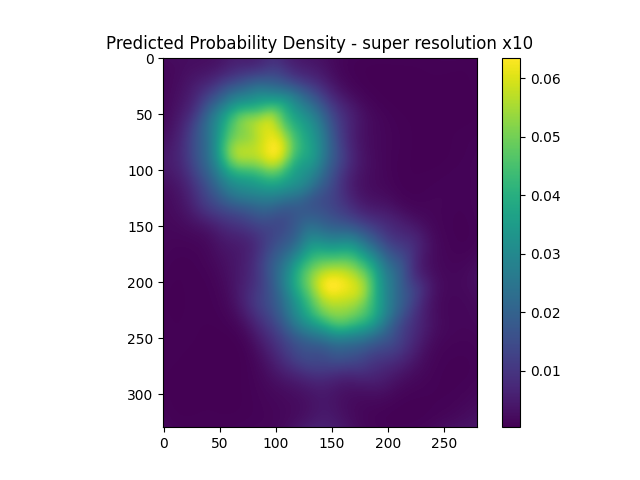
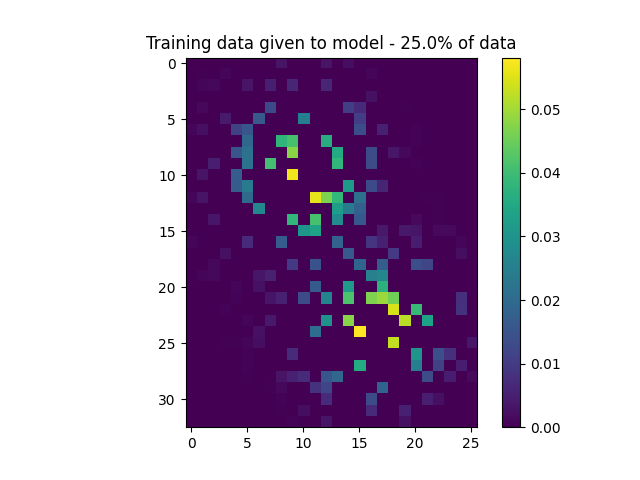
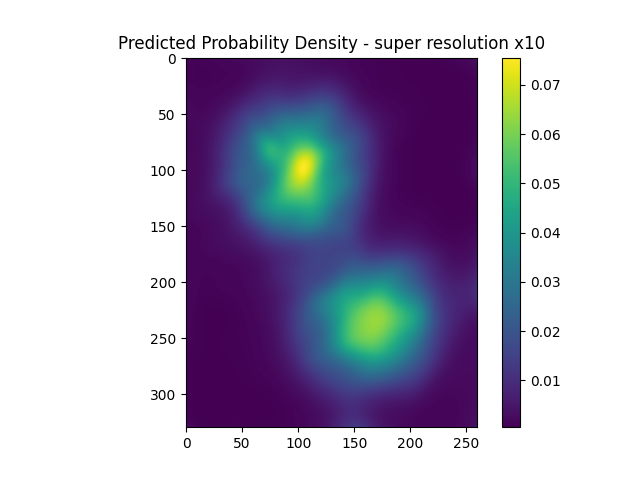

# Learning Probability Density Functions from Samples

Small experiment to see if it's possible to learn the PDF of an arbitrary distribution given some samples from it.

## Experiment 1 - Preliminary

Below: a SIREN network learns the continuous PDF of two gaussians.

- **Input:** A discrete PDF generated from the samples.

- **Output:** A SIREN network that parameterizes the continuous PDF. To demonstrate this, I sampled the discrete PDF domain at 10x resolution, but there is no limit to how finely you can sample probabilities from the SIREN.

Ideally, the volume under the predicted curve should be exactly 1.

#### Predicted volume under curve ≈ 1.006

 

## Experiment 2 - Restricting Training Data

How well does it perform if you only give it a subset of ground-truth probability densities?

### Training on 50% of data

#### Predicted volume under curve ≈ 1.01

 

### Training on 25% of data

#### Predicted volume under curve ≈ 1.01

